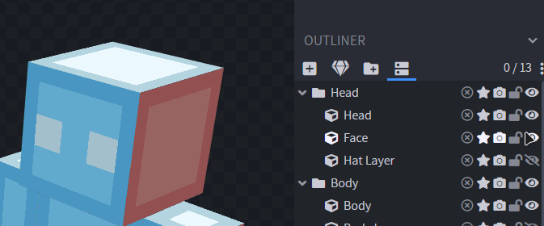
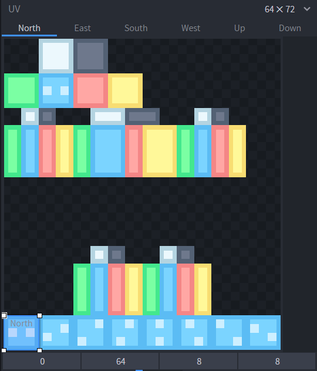
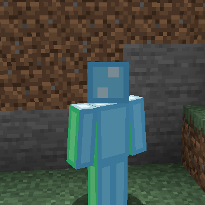
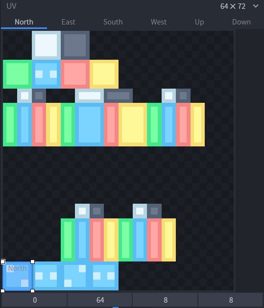
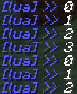
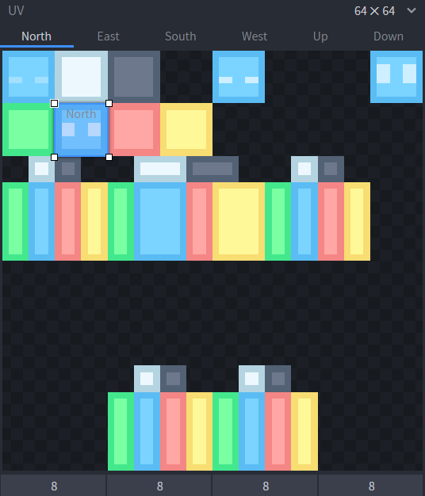
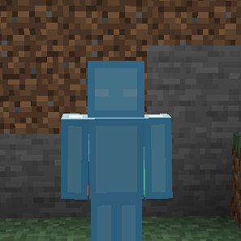
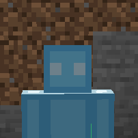

Animating a texture in Figura works differently than in resource packs. Instead of a `.mcmeta` file, we use `ModelPart:setUV(u,v)` to change the texture coordinates a cube is using.

In this tutorial we are going to make a blinking animation. To make it a little easier, I have gone ahead and separated the face from the rest of the head. This is technically optional, but makes things easier because I only want the face to change, and not the entire head, since in figura we can only change UVs of the whole cube at once. (Duplicate the head cube, set the front face to transparent on the head, and all other sides except for the face to transparent on the duplicate. Make sure to be in Per-Face-UV mode for this)

<details>

<summary>Advanced: A way to change UV of only a single face on a cube.</summary>

If you do not want to split up a cube but still want to animate only one of its faces, here is a snippet for you! This snippet adds both a `setFaceUV` and a `setFaceUVPixels` function. Use the same way as the normal uv functions, except add the names of faces you want to change at the end. For example you can do 
`models.model.Head:setFaceUVPixels(u, v, "north")` or `models:setFaceUV(u, v, "north", "east", "up")` or even `models:setFaceUVPixels(vec(u, v), "south")`.

```lua
do
  local orig = {}
  local fmap = {north=0,south=1,east=2,west=3,up=4,down=5}
  local _idx = figuraMetatables.ModelPart.__index
  function figuraMetatables.ModelPart.__index(self, idx)
    if idx == "setFaceUV" or idx == "setFaceUVPixels" then
      return function(slf, u, v, ...)
        local fcs = {...}
        if type(u):match("^Vector%d$") then
          table.insert(fcs, v)
          v = u.y
          u = u.x
        end
        assert(#fcs>0, "No faces were given.")
        if slf:getType() == "GROUP" then
          for _, child in ipairs(slf:getChildren()) do
            child[idx](child, u, v, table.unpack(fcs))
          end
        end
        if slf:getType() ~= "CUBE" then return end
        local verts, dims
        for tex, vs in pairs(slf:getAllVertices()) do
          assert(verts == nil, "Face UV only works if there is only one texture on the cube.")
          dims = idx:find("Pixels") and vec(1,1) or textures[tex]:getDimensions()
          verts = vs
        end
        for _, face in ipairs(fcs) do
          assert(fmap[face], 'Face "'..face..'" does not exist. The available faces are: ['..(function()
            local s = ""
            for k in pairs(fmap) do s=s..'"'..k..'", 'end
            return string.sub(s,1,#s-2)
          end)()..']')
          local i = fmap[face]*4+1
          for j=0,3 do
            orig[verts[i+j]] = orig[verts[i+j]] or verts[i+j]:getUV()
            verts[i+j]:setUV(orig[verts[i+j]] + vec(u,v) * dims)
          end
        end
      end
    end
    return _idx(self, idx)
  end
end
```

</details>



For the first part let's just use this dummy animation. To make it, I just expanded the default texture to make space at the bottom and drew a few frames. Move the UV rectangle of the face to the first frame.



To animate it, all we have to do is make a script that cycles through these. To do this, we will first make a `time` variable that's just a counter that goes up each tick. You could also use `world.getTime()` instead but that can be inconsistent if the server is laggy, so just add this little code into your script:

```lua
time = 0
function events.tick()
    time = time + 1    
end
```

Then we can use the `ModelPart:setUV(u,v)` function, which shifts the UV box by a given amount. It will offset it relative to the default position we have given it in BlockBench, in this case the lower left corner. Since `setUV` takes a fraction as input (1 means whole texture size, 1/2 means half of the texture size, etc..) we can just shift it 1/8 every step to make it go through all 8 frames. Since the time increases by 1 every tick, we tie the UV to `time/8` which will make it shift 1/8 each tick.

```lua
time = 0
function events.tick()
    time = time + 1    
end

function events.tick()
    models.model.Head.Face:setUV(time/8,0) -- use the time variable to shift the UV
end
```

We don't even have to clamp the time value in between 0 and 7 because `setUV` just cycles around the texture if the value overflows.



Note that the rest of the tutorial assumes you keep the little tick event for the `time` variable and we will not show it again from now on to save some space in the tutorial.

If we want to make the animation slower, we can divide the time by some value to essentially make time go slower for our animation. Note that this will produce floating point values like 9/2=4.5, so it wouldn't shift the full 1/8 step and display some weird selection inbetween our frames. To fix this we can floor it to the next integer.

```lua
function events.tick()
    models.model.Head.Face:setUV(math.floor(time/2)/8,0)
end
```

You can see that normally we displayed every frame for one tick, but if we divide the time by 2 it would display every frame for two ticks making it slower. If we write down each time value and the calculated frame we would display, it would look like this:

```
floor(time/2) = frame
floor(0/2) = 0
floor(1/2) = 0
floor(2/2) = 1
floor(3/2) = 1
floor(4/2) = 2
floor(5/2) = 2
...
```

Now let's suppose you wanted to use less frames. To prevent the UV from scrolling through the entire texture, and instead only use 4 frames for example, we can use the modulo operator, which returns the remainder you get if you would do an integer division, for example `6 % 4 = 2` because `6 / 4 = 1 with remainder of 2`.



```lua
function events.tick()
    models.model.Head.Face:setUV((time % 4)/8,0)
end
```

If you try adding this code in the tick event `print(time % 4)` it will print it in chat and you will see that it only ranges from 0 to 3 and then starts over again even if the time counter is actually already much higher than 4.



What if you had a really messy texture and no easy way to lay out your frames all next to each other though? To demonstrate, I have resized the texture back to the normal 64x64 size and I placed my frames on unused spaces. I made a simple blinking animation.



This time we are going to use pixels measurements instead. To use a pixel value, divide your value by the texture size. This is similar to before, where we wanted to step in 1/8ths, but this time if the texture size is 64 then we want to step in 1/64ths to essentially step in pixel units. For example, to shift my UV rectangle to the top right corner from where it started, it would need to be offset by 8 pixels up and 48 pixels to the right. Since the UV coordinates go "right" and "down", moving it 8 pixels up would mean we want to move it "-8 pixels down".

```lua
local width = 64
local height = 64
models.model.Head.Face:setUV(48/width,-8/height)
```

To manage the UV offsets we can create a table containing all the values, and then just cycle through them similar to what we did earlier. We wrap the values using vec() to turn them into a vector, so that we are able to pass both values at once.

```lua
local frames = {
    vec(0,0),         -- open eyes
    vec(24/64,-8/64), -- half closed eyes
    vec(-8/64,-8/64), -- closed eyes
    vec(48/64,-8/64)  -- wide open eyes
}

function events.tick()
    models.model.Head.Face:setUV(frames[(time % #frames) + 1])
end
```

But where does the `frames[(time % #frames) + 1]` come from? Well, to access one of these frames positions, we do `frames[number]` for example `frames[1]` gives us `vec(0,0)` which is the first one.
Additionally `#frames` just means the number of frames we have, in this case 4. So by doing `time % #frames` or `time % 4` we again get values cycling from 0,1,2,3 and then repeat. However, we want values from starting at 1, like 1,2,3,4. So we can just add one after the previous calculation to shift them all up, giving us the desired outcome of `(time % #frames) + 1` to access our frames.

As you can see, it is now playing the blinking animation.



To make it not play continuously, we can wait a bit until we restart the animation. For this its easier to make our own timer variable, so that the time isnt always increased each tick automatically, but instead we can choose to wait and only increase it when we want the blink to happen. To do this we make a `frame` variable which will replace our usual `time` in this case and just tells us which frame we are currently displaying, and a `nextBlink` variable that stores the moment in time when we want the next blink to happen. We can even add a bit of randomness into the blinking delay by using `math.random(min,max)` which gives us a number between min and max.

```lua
local frames = {
    vec(0,0),         -- open eyes
    vec(24/64,-8/64), -- half closed eyes
    vec(-8/64,-8/64), -- closed eys
    vec(48/64,-8/64)  -- wide open eyes
}

local frame = 1
local nextBlink = 0

function events.tick()
    if frame > 4 then -- if we cycled through all 4 frames..
        frame = 1 -- ..reset animation..
        nextBlink = time + math.random(20,50) -- ..and choose the next blink time a random amount of ticks in the future
    end
    models.model.Head.Face:setUV(frames[frame]) -- regular setUV as always
    -- now wait for the time to be greater than our next blink time before increasing the animation frame
    if nextBlink < time then
        frame = frame + 1
    end
end
```

(Note that my screen recorder seemingly didn't manage to get enough fps to record all frames so the gif might look like some are skipped.)



If your texture is layed out in a grid shape instead of a single strip, then we can convert our time into U and V coordinates using this calculation:

```lua
u = time%width
v = math.floor(time/width)
```

To implement that you could do something like below, with the example of a 4x4 grid on the texture:

```lua
local width = 4
local height = 4
function events.tick()
    local u = time%width
    local v = math.floor(time/width)
    models.model.Head.Face:setUV(u/width,v/height)
end
```
