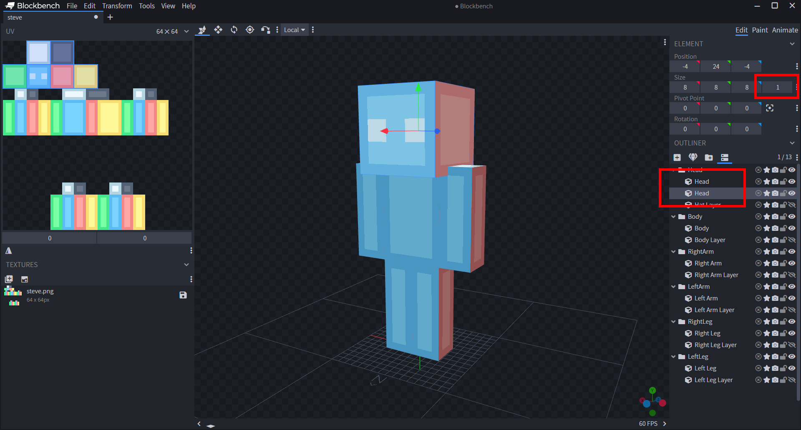
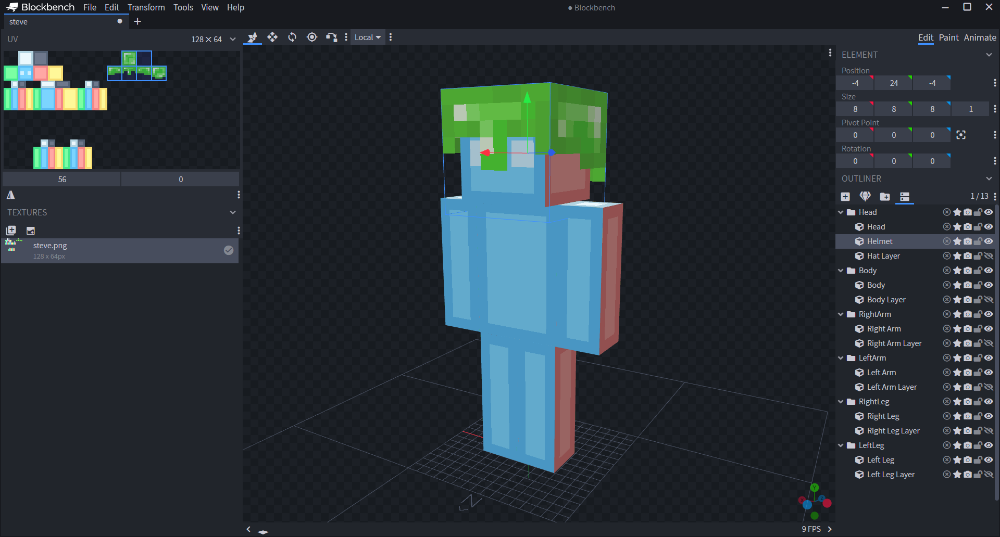
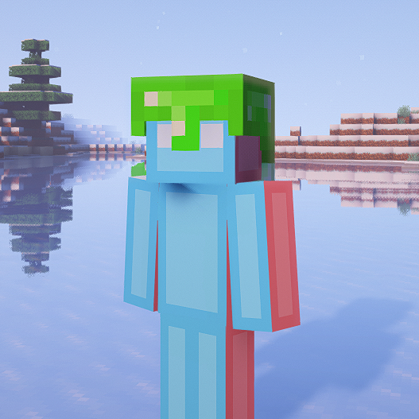
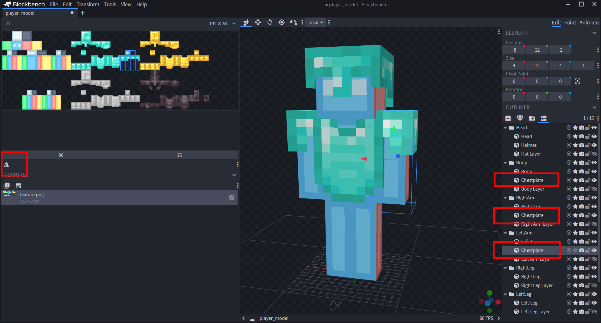
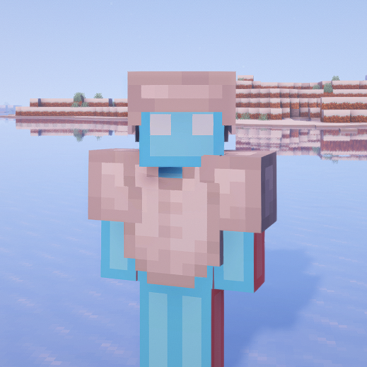
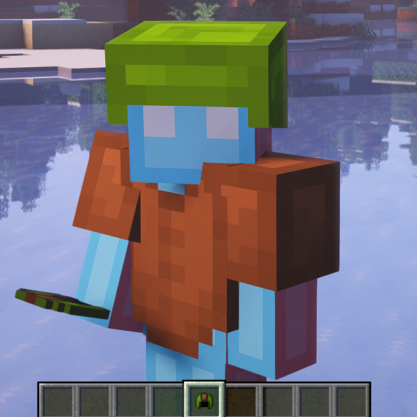
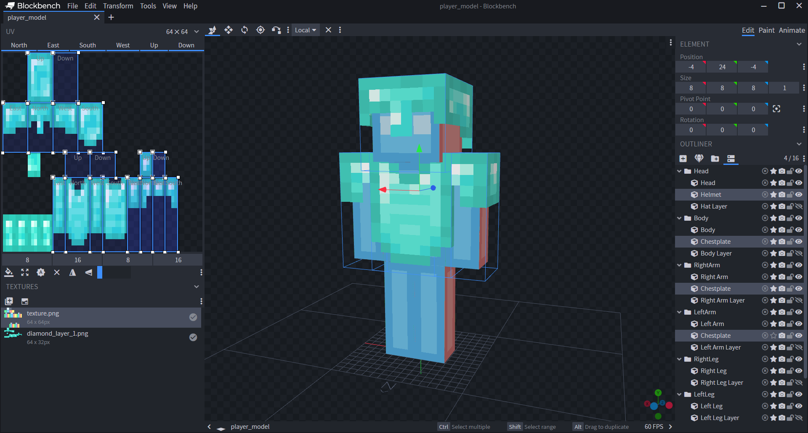
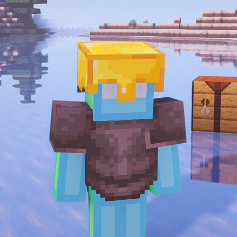
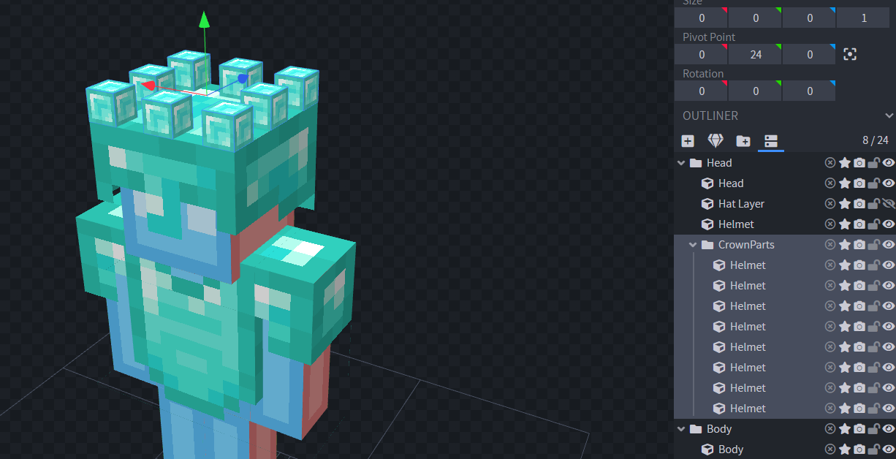
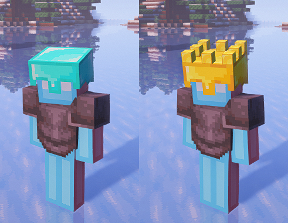

There are several ways to make custom armor. Let's take a look at a few of them:

- Resizing / Repositioning vanilla armor
- Custom armor using custom texture
- Custom armor using vanilla textures
- Unique shapes for different materials

# Resizing / Repositioning vanilla armor

If your model is humanoid and has roughly the same proportions of the vanilla player, it might be enough to just slightly move the vanilla armor around. To do this, simply use `setPos` and `setScale` like so:

```lua
vanilla_model.HELMET_HEAD:setPos(0,-3,0)
vanilla_model.HELMET_HEAD:setScale(0.9,0.9,0.9)
```

# Custom armor using custom texture

First, don't forget to hide the vanilla armor.

```lua
vanilla_model.ARMOR:setVisible(false)
```

If you want custom armor, simply make cubes for it in BlockBench. Make sure that they are inside your keyword groups so they also move along with the body parts. A simple way to make armor is to duplicate a cube and using the inflate value to make it a little bigger. Then move it's UV to a new spot where you can put the armor texture.

Here are the inflate values you should be using:

Helmet | 1
Chestplate | 1.01
Arms | 1
Belt | 0.51
Legs | 0.5
Boots | 1

Here is an example on how to make a helmet:




It might look a little big in BlockBench, but in game it will actually look fine:



After you made your complete set of custom armor, you can then add multiple materials for it to switch to. I have added a chestplate and 4 materials for demonstration. Note that you can use the "Mirror UV" button for the left arm or leg to flip the texture the correct way.



Now we will make a script that enables or disables our parts whenever we wear armor, and also checks what kind of armor we are wearing to decide what material to show.

Here is a really handy utility function for selecting UV offsets according to a material. Just put the correct UV offsets into the `materials` table. Since our UV is originally at diamond, we will put `vec(0,0)` for it. Then just fill in the other ones. This even works with modded materials if you wanted to.

```lua
-- These values are later used for setUV
materials = {
    ["diamond"]=vec(0,0),
    ["golden"]=vec(56/192,0),
    ["netherite"]=vec(56/192,32/64),
    ["leather"]=vec(0,32/64),
}

-- This function checks the name of an item to return the
-- corresponding material from the table above.
function material(item)
    local name = item:sub(item:find(":")+1)
    local n = name:find("_")
    local mat = name:sub(0,n~=nil and n-1 or name:len())
    local uv = materials[mat]
    return (uv~=nil and uv or vec(0,0))
end
```

For example, if we now call `material("minecraft:netherite_helmet")` or `material("minecraft:netherite_chestplate")` it will return `vec(56/192,32/64)` both times.

You can obviously add more materials if you'd like.

Now let's actually make the armor work, shall we?

```lua
function events.tick()
    -- First get all the equipped armor pieces
    local helmet = player:getItem(6)
    local chestplate = player:getItem(5)
    local leggings = player:getItem(4)
    local boots = player:getItem(3)

    -- Move UV according to the material
    models.model.Head.Helmet:setUV(material(helmet.id))
    models.model.Body.Chestplate:setUV(material(chestplate.id))
    models.model.RightArm.Chestplate:setUV(material(chestplate.id))
    models.model.LeftArm.Chestplate:setUV(material(chestplate.id))

    -- Enable armor when wearing something, disable when not
    models.model.Head.Helmet:setVisible(helmet.id~="minecraft:air")
    models.model.Body.Chestplate:setVisible(chestplate.id~="minecraft:air")
    models.model.RightArm.Chestplate:setVisible(chestplate.id~="minecraft:air")
    models.model.LeftArm.Chestplate:setVisible(chestplate.id~="minecraft:air")

    -- You can also add enchantment glint
    models.model.Head.Helmet:setSecondaryRenderType(helmet:hasGlint() and "Glint2" or "None")
    models.model.Body.Chestplate:setSecondaryRenderType(chestplate:hasGlint() and "Glint2" or "None")
    models.model.RightArm.Chestplate:setSecondaryRenderType(chestplate:hasGlint() and "Glint2" or "None")
    models.model.LeftArm.Chestplate:setSecondaryRenderType(chestplate:hasGlint() and "Glint2" or "None")
end
```

Now this almost works, the only thing missing is the leather color.



We can use the following function to get the color of an armor piece:

```lua
function getColor(stack)
    if not stack.id:find("leather") then return vec(1,1,1) end
    local tag = stack:getTag()
    if tag ~= nil and tag.display ~= nil then
        return vectors.intToRGB(tag.display.color)
    end
    return vec(160/255, 101/255, 64/255) -- default leather color
end
```

With that, we can add coloring to the bottom of our tick function:

```lua
models.model.Head.Helmet:setColor(getColor(helmet))
models.model.Body.Chestplate:setColor(getColor(chestplate))
models.model.RightArm.Chestplate:setColor(getColor(chestplate))
models.model.LeftArm.Chestplate:setColor(getColor(chestplate))
```

And there we go!



# Custom armor using vanilla textures

Alternatively, you can use the vanilla armor textures. This makes it so your armor works with resource packs and you also don't have to use space on your texture.

For this it is useful to import one of the texture files into your BlockBench project, in order to figure out the proper UV that is needed.

As you can see, the UVs are a little stretched (double it's height to be exact). This is because the armor texture file is 32 pixels high, but the models texture is 64 pixels high. To stretch individual faces you must be using per-face-UV mode.



In our script, instead of UV offsets we will now be using vanilla texture file names:

```lua
materials = {
    ["diamond"]="minecraft:textures/models/armor/diamond_layer_1.png",
    ["golden"]="minecraft:textures/models/armor/gold_layer_1.png",
    ["netherite"]="minecraft:textures/models/armor/netherite_layer_1.png",
    ["leather"]="minecraft:textures/models/armor/leather_layer_1.png",
}
```

Then in our tick function, instead of using `setUV`, we will be using `setTexture`:

```lua
-- Select texture according to the material
models.model.Head.Helmet:setPrimaryTexture("Resource", material(helmet.id))
models.model.Body.Chestplate:setPrimaryTexture("Resource", material(chestplate.id))
models.model.RightArm.Chestplate:setPrimaryTexture("Resource", material(chestplate.id))
models.model.LeftArm.Chestplate:setPrimaryTexture("Resource", material(chestplate.id))
```

Now our armor works even with a resource pack! (I am using Faithful 32x here)



# Unique shapes for different materials

Lastly, what if you wanted to make different shapes for your materials. Let's make the golden helmet look like a crown. I made a really quick crown model (these cubes sticking out just use the top face texture of the helmet):



Remember that the texture in BB is not actually going to be used by our model! Instead, add a line to our `setTexture`s (or `setUV`s, if you are using custom texture):

```lua
mdoels.model.Head.CrownParts:setPrimaryTexture("Resource", material(helmet.id))
```

Then make sure that it will only be visible if the player is wearing gold:

```lua
mdoels.model.Head.CrownParts:setVisible(helmet.id == "minecraft:golden_helmet")
```


