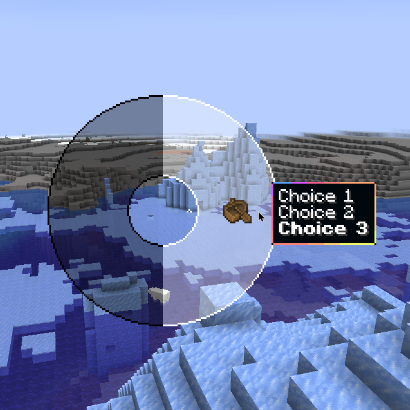

# Figura Basics

## Globals

Maybe the single most important thing in Figura is the globally accessible variables that are instances of all the APIs that are available. Whenever you find any API on the wiki or figs, it's name will be something like `ActionWheelAPI` or `EventsAPI` `SoundsAPI` and there is always a global variable that you can use to access those which are called `action_wheel` or `events` or `sounds`.

These are also listed as "Global Objects" in <a href="https://applejuiceyy.github.io/figs" target="_blank" rel="noopener noreferrer">Figs</a> on the left hand side.

## Events

### Tick And Render

You already know that lua code runs and finishes pretty much immediately. But most of the time you want your code to do things the entire duration while youre wearing the avatar. Thats where events come in. The most important event is the tick event, which is called every in game tick, which is 20 times per second. To register a tick event, simply create a tick function inside of the events table like this:

```lua
function events.tick()
    -- Figura will call this function every tick (20 times a second)
end

function events.render(delta)
    -- Figura will call this function every frame when your model is visible
    -- (Therefore depends on your fps)
end
```

### Render Delta Smoothing

You will always want to do most stuff and calculations inside the `tick` event and then smooth them out in the render event by using the delta. Note that you are allowed to have multiple tick or render functions (unlike regular functions which names have to be unique).

The usual delta smoothing process looks something like the next snippet and is needed quite often. It works by interpolating between the last and current ticks calculated value with the render delta, which is the fraction how far this rendered frame is in between the last and next tick.

```lua
local previousValue = 0
local currentValue = 0

function events.tick()
    previousValue = currentValue -- remember the previous currentValue
    currentValue = someThingThatGetsANewValue() -- update the actual currentValue
end

function events.render(delta)
    -- interpolate and apply the value to something
    models:setPos(0,math.lerp(previousValue, currentValue, delta),0)
end


-- just an example function, you don't have to use this
function someThingThatGetsANewValue()
    return math.sin(world.getTime()*0.1)*5
end
```

### Checking If The Player Is Loaded

If you need to access the `player` global at the start of your script, this will lead to an error. Use the entity_init event, which runs once when the player loads in.

```lua
local position = player:getPos() -- ERROR! Player hasn't loaded yet.


-- Correct way:
local position = nil
function events.entity_init()
    position = player:getPos()
end
```

Don't worry, for the tick and render events the player is already guaranteed to run.

However, for some events you should add a `if player:isLoaded()` check before trying to access the `player`. This includes pings, world events, sound events probably more (just think if whatever the event is might be able to happen when your player character isn't here).

In such cases you can simply return from the function and not do anything, see also in the next section about replacing sounds.

### Replacing Sounds

```lua
function events.ON_PLAY_SOUND(id, pos, vol, pitch, loop, category, path)
    if not path then return end -- don't trigger if the sound was played by figura (prevent infinite loop)
    if not player:isLoaded() then return end -- don't trigger if the player isn't loaded
    local nearest, uuid = math.huge -- we will find the nearest player to the sound location
    for _, plr in pairs(world.getPlayers()) do
        local dist = (plr:getPos() - pos):length()
        if dist < nearest then nearest,uuid = dist,plr:getUUID() end
    end
    if player:getUUID() ~= uuid or nearest > 0.8 then return end -- don't trigger if the sound isn't near you

    ---------------------------------------------------------
    -- actual replacing starts here, feel free to edit below:
    if id:find(".step") then                                                  -- if sound id contains ".step"
        sounds:playSound("minecraft:entity.iron_golem.step", pos, vol, pitch) -- play a custom sound
        return true                                                           -- stop the actual step sound
    end
end
```

### Other Events

Other useful events are listed on the wiki <a href="https://figura-wiki.pages.dev/globals/Events" target="_blank" rel="noopener noreferrer">here ↗</a>

## Intervals And Timings

First we make a new tick event to make a constantly counting time variable. This will be used instead of `world.getTime()` because that can be inconsistent and jump around a lot if the server is very laggy. So instead we make a consistent global time counter, that we will assume is in your script for all the following snippets.

```lua
time = 0
function events.tick()
    time = time + 1
end
```

### Run Every X Ticks

Runs once every 5 seconds (once every 5*20=100 ticks)

```lua
function events.tick()
    if time % (5*20) == 0 then
        print("This happens only every 20 ticks")
    end
end
```

### Randomized Intervals

This one runs once every time a random amount between 100 and 200 ticks has passed.

```lua
local nextTrigger = 0
function events.tick()
    if time >= nextTrigger then
        nextTrigger = time + math.random(100,200)
        -- do something here
    end
end
```

### Basic Timer

With this you can restart the timer any time by just setting `myTimer = 100` (or any amount) for example in a keybind or action wheel or whatever else.

```lua
local myTimer = 0
function events.tick()
    if myTimer > 0 then
        myTimer = myTimer - 1
    elseif myTimer == 0 then
        print("timer ended")
    end
end

-- assume in keybind:
myTimer = 100
```

Alternatively you could also utilize our `time` counter by setting this `triggerTime = time + 100` so it's a timestamp 100 ticks in the future.

```lua
function events.tick()
    if time == triggerTime then
        log("timer ended")
    end
end

-- assume in keybind:
triggerTime = time + 100
```

You can also use runLater which is a tiny library, check it out <a href="https://github.com/Manuel-3/figura-scripts/tree/main/src/runLater" target="_blank" rel="noopener noreferrer">here ↗</a>. It helps scheduling things to run at a later time, or wait until some condition turns true.


## Accessing The BlockBench Model

Figura provides a global variable called `models` which contains all your blockbench files. This will give you access to your BlockBench models. You can access a specific model with `models.filename`. It is structured the exact same way the outliner in BlockBench shows your cubes and groups.


```lua
models.mymodel.Head.Hat:setVisible(false) -- hides the hat
```

See also the <a href="https://figura-wiki.pages.dev/tutorials/ModelPart%20Indexing" target="_blank" rel="noopener noreferrer">Model Part Indexing Tutorial</a>.

To access BlockBench model parts you use the `models` global. Its a table containing all models and the groups and cubes in a tree structure. Once you accessed a model part you can use all the functions on them that you can find in <a href="https://applejuiceyy.github.io/figs/latest/ModelPart/ModelPart" target="_blank" rel="noopener noreferrer">ModelPart</a>.

### Iterating The Model Tree

If you want to go over all model parts in a loop use either a depth first or breadth first approach, for most things depth first is fine since the code is shorter.

The `process` function would be whatever you want to do on each model part.

Depth First Search:

```lua
function dfs(part, process)
    process(part)
    for _, child in ipairs(part:getChildren()) do
        dfs(child, process)
    end
end
```

Breadth First Search:

```lua
function bfs(part, process)
    local queue = {part}
    while #queue > 0 do
        local current = table.remove(queue, 1)
        process(current)
        for _, child in ipairs(current:getChildren()) do
            table.insert(queue, child)
        end
    end
end
```

Example, look for any group including "Red" in the name and coloring them red.

```lua
dfs(models, function(part)
    if part:getType() == "GROUP" and part:getName():find("Red") then
        part:setColor(1,0,0)
    end
end)
```

### Getting The Texture Of A Cube

The getTextures or getPrimaryTextures etc functions are all kind of broken and bugged. The most reliable way to get the texture of a part is by using `getAllVertices`.

This is because it returns a table with the texture names as the keys and lists of vertices as the values. This means we can use it just for the texture names portion. Usually you go over those vertices like this, which is also useful to know just in general:

```lua
for textureName, vertexList in pairs(cube:getAllVertices()) do
    for index, vertex in ipairs(vertexList) do
        print(index, vertex:getPos())
    end
end
```

But we can just use it for the texture name and return the texture with that name:

```lua
local function getTexture(cube)
    for textureName in pairs(cube:getAllVertices()) do
        return textures[textureName]
    end
end
```

## Accessing The Vanilla Model

If the standard keywords like Head, Body, RighArm etc dont quite perfectly fit for you cou can access the vanilla rotation and position values of all the body parts and then manually apply them to your model while also adjusting those values. For example, you could make the arms or legs swing around less far, or you could add limits to the head rotation.

Make sure **not** to use keywords when doing this, otherwise it will double the movement! (e.g. change groups like LeftLeg to something like leftleg to remove keyword)
See what parts are in vanilla model [here](<https://figura-wiki.pages.dev/globals/Vanilla-Model/VanillaModel#parts>).

```lua
function events.render()
    -- copy cape 1:1 no change
    models.model.cape:setRot( vanilla_model.FAKE_CAPE:getOriginRot() )
    -- copy leg with simple change like scaling
    models.model.leftleg:setRot( vanilla_model.LEFT_LEG:getOriginRot() * 0.5 )
    -- more flexible change by storing in a variable
    local headrot = (vanilla_model.HEAD:getOriginRot()+180)%360-180
    models.model.head:setRot(0,headrot.y,0)
end
```

You might be confused about the `(vanilla_model.HEAD:getOriginRot()+180)%360-180` in there, and this is only needed for the vanilla head because minecraft can kind of freak out and give incorrect rotation values if you really quickly fling the camera around, this math just fixes that issue and returns the real head rotation.


## User Input

### Pings

Before actually reading any user input, note that pings are required. The are used to send information that is only available to the host (you) to all other players. This applies to all user input since what you type on your keyboard or click with your mouse is not automatically synced to other players. To make a ping, create a function inside the `pings` table, for example we make a custom ping named `setHat` to change the visibility of a model part hat:

```lua
function pings.setHat(value)
    models:model.Head.Hat:setVisible(value)
end
```

Whenever you call `pings.setHat(value)` this function will be executed on all instances of your script (so on all players including yourself). Calling a ping function only sends a ping on the host instance of the script, other players seeing your model and running the script just ignore this line of code. Instead they will run the function whenever they receive that they should from the host.

For more information about pings see <a href="https://figura-wiki.pages.dev/tutorials/Pings" target="_blank" rel="noopener noreferrer">pings wiki page ↗</a> and [learn about common ping misconceptions](/ping-misconceptions).

### Basic Text Input

Similar to custom commands, here is how to ask an input from the player that they can type in chat. It works by temporarily registering a chat_send_message event that cancels the next message that is tried to be sent, and instead reads it as an input.

```lua
function input(question, callback)
    logJson(question)
    local e = events.CHAT_SEND_MESSAGE
    local function f(m) callback(m) e:remove(f) end
    e:register(f)
end
```

Example:

```lua
function pings.printName(name)
    print("Hello "..name.."!")
end
input("Whats your name?", pings.printName)
```

### Custom Commands

Here is how to make a very simple commands system. Example with greet comand `/greet Steve` would print "Hello there Steve!". All the separate words in your command can be accessed with `cmd[n]`. In the greet example it would be `cmd[1]` is "/greet", `cmd[2]` is "Steve", and an later ones such as `cmd[3]` are `nil`.
You can also use characters other than "/" for the start of your commands if you want.

```lua
-- First add the commands you want into this list
local commands = { "/greet", "/test" }
function pings.command(cmd)
  -- Then put your command logic here in this ping

  -- Example command: /greet
  if cmd[1] == "/greet" then
    print("Hello there " .. tostring(cmd[2]) .. "!")
  end

  -- Example command: /test
  if cmd[1] == "/test" then
    print("This is a test command.")
  end
end

-- Backbone of the commands system, don't edit this
function events.chat_send_message(msg)
  local cancel = true
  for _, command in ipairs(commands) do
    if msg:match("^"..command:gsub("([^%w])", "%%%1")) then cancel = false end
  end
  if cancel then return msg end
  local cmd = {}
  for w in msg:gmatch("%S+") do table.insert(cmd, w) end
  pings.command(cmd)
  return nil
end
```

### Action Wheel

First off, check out the basic <a href="https://figura-wiki.pages.dev/tutorials/ActionWheel" target="_blank" rel="noopener noreferrer">Action Wheel Tutorial ↗</a>. It also explains how to make a toggle action.

The action wheel allows us to bring up a wheel by pressing `B` and we can attach functions to the slots.

```lua
local mainPage = action_wheel:newPage()
local action = mainPage:newAction()
    :title("Click me")
    :item("minecraft:grass_block")
    :setOnToggle(function(state) -- anonymous function, does not have a name
        pings.setHat(state) -- for example we call the ping from before
    end)
```

#### Toggle More Than Two States

Many times people would like more than two things to toggle between, so here is how to add an arbitrary amount of toggles to only one single action.

Use a number that counts up and then cycles back around to 1 when the max value was hit, for example increase it every time you click the action and when it is above 3 then go back to 1.

The way to do that in just one line would be like follows. It cycles the variable `n` in a range 1 to X. Here some examples:

```lua
-- universal, amount could be 1, or -1, or any number
n = (n - 1 + amount) % X + 1

-- increment by 1   (n - 1 + 1)
n = n % X + 1

-- decrement by 1   (n - 1 - 1)
n = (n - 2) % X + 1
```

And how to actually use it in the action wheel.

```lua
local tbl = {"option1", "option2", "option3"}
local selected = 1
function pings.select(x)
    selected = x
    print(tbl[selected])
end
pings.select(1)
action:onLeftClick(function()
    pings.select(selected % #tbl + 1)
end)
```

For clarity, the following code would do the same thing and might be a bit easier to understand:

```lua
local tbl = {"option1", "option2", "option3"}
local selected = 1
function pings.select(x)
    selected = x
    print(tbl[selected])
end
pings.select(1)
action:onLeftClick(function()
    selected = selected + 1
    if selected > #tbl then
        selected = 1
    end
    pings.select(selected)
end)
```

<details>

<summary>If you would like a copy paste snippet that adds a more polished version of such a multiple choices action click here.</summary>

You can click or scroll to switch through the choices. Icon and title automatically updates with the selected choice in bold.

Example (note this is without a ping, and expects a mainPage to already exist):

```lua
local myChoices = {
  {text="Choice 1", item="acacia_boat"},
  {text="Choice 2", item="oak_boat"},
  {text="Choice 3", item="spruce_boat"},
}
local action = mainPage:newChoice(myChoices,function(index)
  log("selected", index)
end)
```



To be able to use it, copy paste this snippet above/before your action wheel code:

```lua
local figuraMetatablesPage__index = figuraMetatables.Page.__index
figuraMetatables.Page.__index = function(slf, key)
  if key == "newChoice" then
    ---@class Minecraft.RawJSONText.Component
    ---@field text string
    ---@field item ItemStack|Minecraft.itemID
    ---@class Page
    ---@field newChoice fun(self:Page,choices:Minecraft.RawJSONText.Component[],callback:fun(idx:number,self:Action)):Action
    return function(self, choices, callback)
      choices = parseJson(toJson(choices))
      for _,c in ipairs(choices) do
        c.bold = false
        c.text = c.text..'\n'
      end
      choices[#choices].text = choices[#choices].text:gsub('\n$','')
      local idx = #choices
      local action = self:newAction()
      local function interact(dir,act)
        if player:isLoaded() then
          sounds:playSound("block.copper_bulb.turn_on",player:getPos(),1,1)
        end
        choices[idx].bold = false
        idx = (idx - 1 - math.sign(dir)) % #choices + 1
        choices[idx].bold = true
        action:title(toJson(choices)):item(choices[idx].item)
        callback(idx,act)
      end
      interact(-1)
      action.rightClick = function()interact(1,action)end
      action.leftClick = function()interact(-1,action)end
      action.scroll = interact
      return action
    end
  end
  return figuraMetatablesPage__index(slf, key)
end
```
</details>

#### Fallback Action Item

If you want to make your avatar work for multiple Minecraft versions, make sure the code doesn't error when it encounters an item that doesn't exist yet in this version.

```lua
local function firstValidItem(...)
  for _, i in ipairs({...}) do
    if pcall(function()
      _ = world.newItem(i)
    end) then
      return i
    end
  end
  return "minecraft:air"
end
```

Example:

```lua
action:setItem(firstValidItem("iron_spear", "wind_charge", "snowball"))
```

### Keybinds

Check out the <a href="https://figura-wiki.pages.dev/tutorials/Keybinds" target="_blank" rel="noopener noreferrer">Keybinds Tutorial ↗</a> and a list of keys can be found <a href="https://applejuiceyy.github.io/figs/latest/Keybinds/" target="_blank" rel="noopener noreferrer">here on Figs ↗</a>.

```lua
function pings.onPressG()
    print("G key was pressed!")
end
keybinds:newKeybind("Send Hooray Button", "key.keyboard.g")
    :setOnPress(function()
        pings.onPressG()
    end)
```

#### Toggle Keybind

How to make a toggle keybind, similar to the inbuilt toggle action.

```lua
local keybindState = false -- This variable gets toggled at every key press
function pings.keybindToggled(state)
    keybindState = state
    -- put your code here
end
local keybind = keybinds:newKeybind("Display Name", "key.keyboard.space")
    :setOnPress(function()
        pings.keybindToggled(not keybindState)
    end)
```
