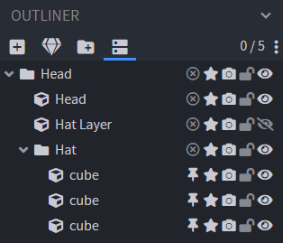

Now that you [know how to program](/lua-quickstart), you should be able to use <a href="https://figura-wiki.pages.dev/" target="_blank" rel="noopener noreferrer">the wiki ↗</a> to get what you need.

Before you start, note that there is a <a href="https://marketplace.visualstudio.com/items?itemName=Manuel-Underscore.figura" target="_blank" rel="noopener noreferrer">Figura VSCode extension ↗</a> which provides autocomplete for BlockBench models and <a href="https://github.com/GrandpaScout/FiguraRewriteVSDocs" target="_blank" rel="noopener noreferrer">Figura docs ↗</a> to provide autocomplete for all Figura features. (To install in VSCode, click on extensions icon to the left, search for "Figura", click install. Docs need to be downloaded manually.)

# Basics

Your script is executed when your avatar loads. For you this happens when you equip the avatar, for other players when you enter their render distance.

Most importantly, if your avatar loads your code will only be executed once, however most of the time you want to continuously check your player's state and act accordingly to it.

If you register a `tick` or `render` function to Figuras events, it will call them every tick or frame respectively. There is also `world_render` which is similar to `render` except that it will also run every frame if your model is not in the player's view.

```lua
function events.tick()
    -- Figura will call this function every tick (20 times a second)
end

function events.render(delta)
    -- Figura will call this function every frame when your model is visible
    -- (Therefore depends on your fps)
end
```

You will do most stuff inside the `tick` function. Note that you can have multiple tick or render functions (Unlike regular functions which names have to be unique).

# Accessing your model

Figura provides a variable called `models` which contains all your blockbench files. This will give you access to your BlockBench models. You can access a specific model with `models.filename`. It is structured the exact same way the outliner in BlockBench shows your cubes and groups.



```lua
models.mymodel.Head.Hat:setVisible(false) -- hides the hat
```

Here is the [wiki page](https://github.com/KitCat962/FiguraRewriteRewrite/wiki/ModelPart-Indexing) about model parts.

# Action Wheel and Keybinds

The action wheel allows us to bring up a wheel by pressing `B` and we can attach functions to the slots.

```lua
local mainPage = action_wheel:newPage()
local action = mainPage:newAction()
    :title("Click me :D")
    :item("minecraft:grass_block")
    :onLeftClick(function() -- anonymous function, does not have a name
        print("Hooray!")
    end)
```

Now if you click on it, you will see "Hooray!" in chat.

If you want something to happen on a key press (List of keys can be found [here](https://applejuiceyy.github.io/figs/latest/Keybinds/)):

```lua
keybinds:newKeybind("Send Hooray Button", "key.keyboard.g")
    :setOnPress(function()
        print("G key was pressed!")
    end)
```

Important! Other players can not know that you clicked your action wheel or pressed a key! To send the information about it to other players we use Figuras pings system.

# Pings

Pings are used to send information that is only available to the host (you) to all other players. To make a ping function make a function inside the `pings` table like so:

```lua
function pings.setHat(value)
    model.Head.Hat.setEnabled(value)
end
```

Whenever you call `pings.setHat()` this function will be executed on all instances of your script (so on all players including yourself). Calling a ping function only sends a ping on the host instance of the script, other players seeing your model and running the script just ignore this line of code. Instead they will run the function whenever they receive that they should from the host.

Since action wheel and keybinds are only available to you, the host script instance, you will want to ping everyone else to also execute the action bound to it:

```lua
local action2 = mainPage:newAction()
    :title("Hide Hat")
    :onLeftClick(function() -- anonymous function, does not have a name
        pings.setHat(false)
    end)
```
