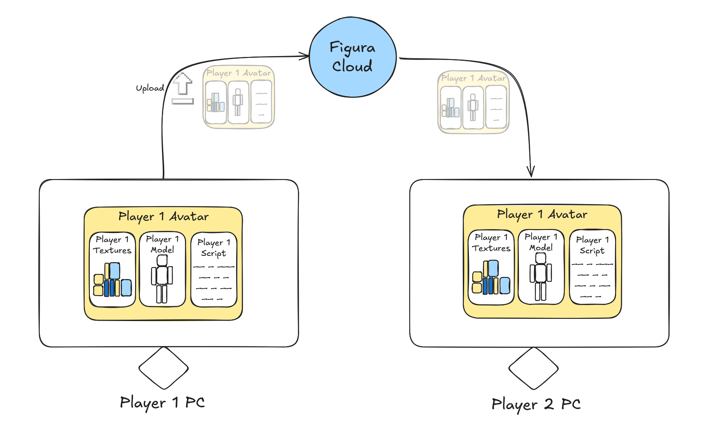
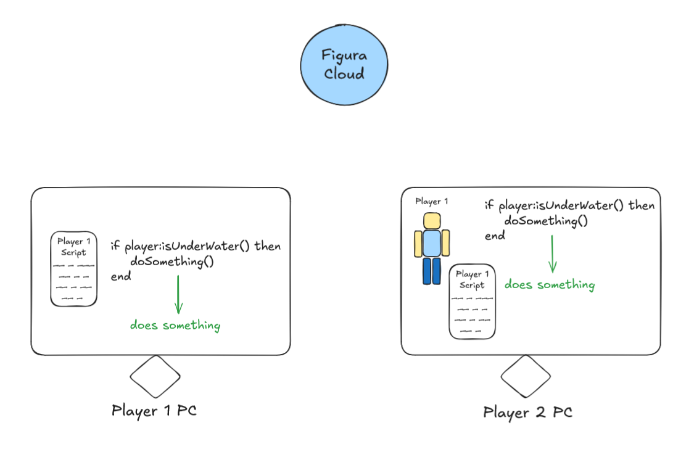
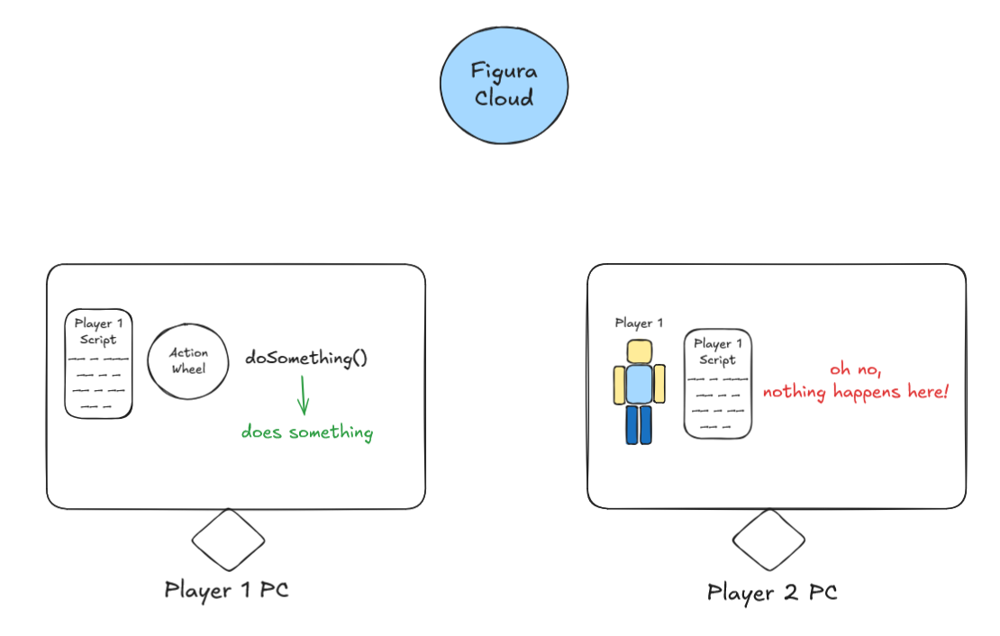
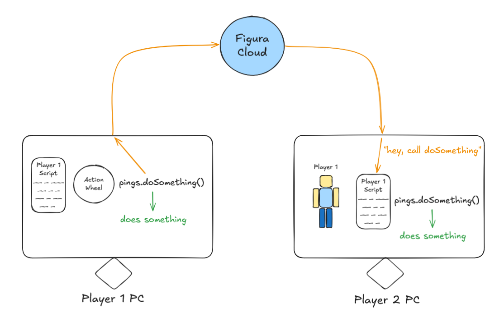
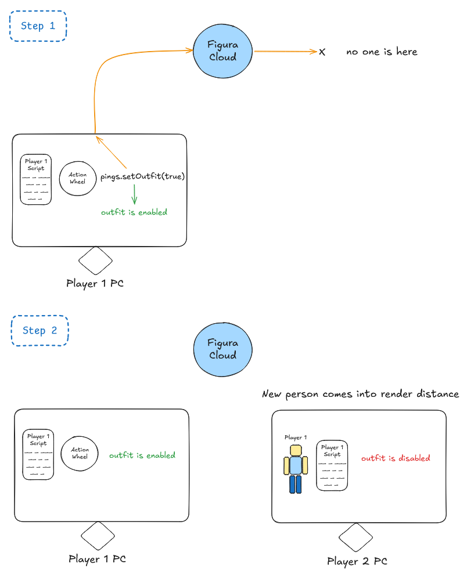
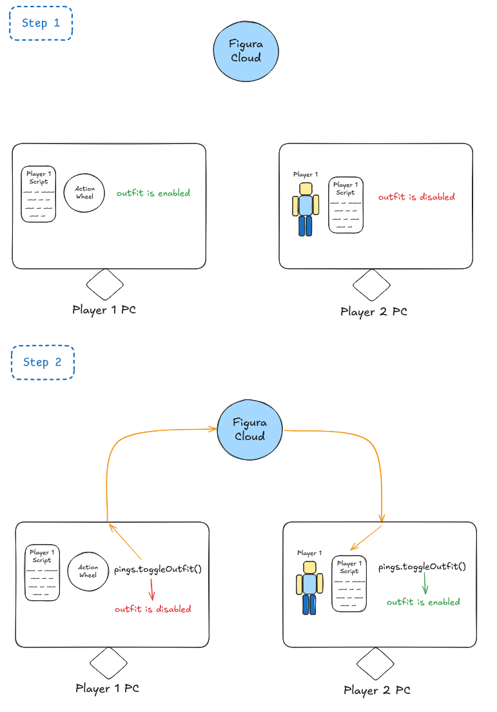
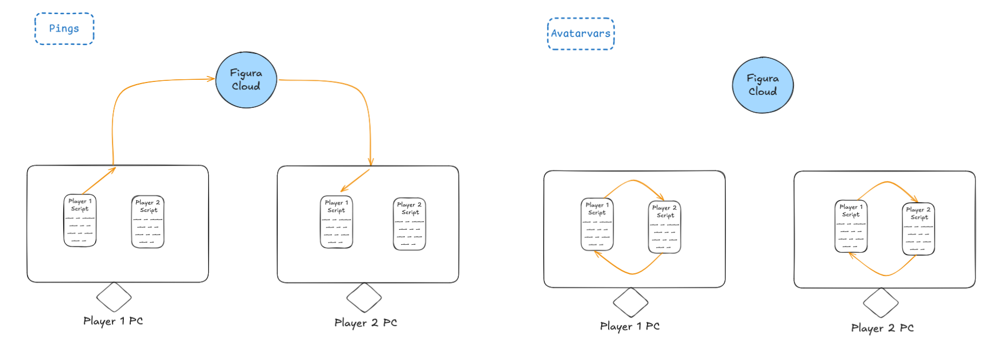

This page is meant to explain how Figura actually works behind the scenes, specifically for lua scripts and pings. This should clear up some common misconceptions a lot of Figura beginners have, and make you much more confident when making your lua scripts.

# Misconception "I need pings for anything to work in multiplayer"

Pings are only needed in very specific situations. After reading this section, you should understand exactly when pings are required and when they are not.

## How do scripts even work?

The most important thing to understand when writing a Figura script is that your script does not only run on your computer. Actually, when you upload your avatar (models, textures, scripts...) to the cloud, every other player on your server has to download this avatar to their own computers in order to display the avatar on your player character. And that means they also download your script, and **run your script on their own PC**.



This of course also applies for the opposite direction, any avatar from your friends on the minecraft server are also sent to you!

But what does that mean and why does it matter? Well, if you think about it, if the script is already running on the other peoples computers, running the same functions and logic that you scripted it to do on your own computer, then you dont need to use pings to send more stuff to other people! Neat! Buttttt... there are a few exceptions of course, otherwise pings wouldn't need to exist.

## When do I actually need pings?

What even is a ping? It is really simple: A ping is just like a regular function in lua, except that it also goes across the Figura cloud to every other player that has downloaded your script and runs the function there too. This means you only need a ping if you must send **additional information** to other players **that they do not already know about**.

<details>

<summary>Side note: Limitations of pings</summary>

Due to the fact that pings are sent over the network, there are a few restrictions to keep in mind.

Pings are rate limited, can only send certain data types over the network, and they are also limited in byte size.

Read more about it <a href="https://figura-wiki.pages.dev/tutorials/Pings#ping-rate-limiting" target="_blank" rel="noopener noreferrer">on the wiki ↗</a>.

</details>

Lets first understand when you **don't** need pings. To do this, you can imagine looking at your friend in multiplayer and thinking about what pieces of **information** you know about them. For example, you know where they are (`player:getPos()`), you know what armor they are wearing (`player:getItem()`), you know what item they are holding in their hand `player:getHeldItem()`, you can see how fast they are moving (`player:getVelocity()`), you can see their head turn and look around `vanilla_model.HEAD:getOriginRot()`, you can see if they are mining blocks `player:isSwingingArm()`, and much more.

So your own PC already knows all these things about your friend, and because your friends script is running on your PC as well, all of these things just work. If the script wants to check if the player is under water it can just do that by itself.



Both instances of the script in this case are in sync and just carry on like normal. So now lets use the action wheel as an example on why pings are necessary. Consider: If you look at another player, can you see their action wheel opening and can you see them click an action? No, you do not have the information if another player is using the action wheel right now. If you just use regular functions it would look like this:



But if you use a ping, it will notify every other instance of your script to also run this ping.



So in conclusion, you only need pings if **the information youre using is not available to other people**.

<details>

<summary>Advanced: I lied.</summary>

Actually a ping is not quite like a regular function like I claimed before. Normally when you call a function, the code inside of it is executed immediately, and when the function finishes it runs the code below it.

```lua
function fn()
    print("2")
end
function events.tick()
    print("1")
    fn()
    print("3")
end
```

The above code would print "1 2 3". However, if you do this with a ping instead, like so:

```lua
function pings.fn()
    print("2")
end
function events.tick()
    print("1")
    pings.fn()
    print("3")
end
```

Then we would have the output "1 3 2". This is because pings are actually scheduled to run after the current execution window on the host.

Now it is a different story on non-hosts (everyone else that youre playing with on the Minecraft server). It can take several ticks for the network to deliver the ping to other people. So in general you can't rely on any certain fixed time frame for pings to run.

There is also a setting within Figura called "Sync pings" which lets you simulate the same behavior that non-hosts have by actually waiting for the Figura cloud to respond with your own ping before running it.

Additionally it might be good to mention that pings received by non-hosts are executed only after the current event finishes, so you don't have to worry about weird behavior such as in the example below, where it wouldn't be good for a ping to run in between the if check and the print statement possibly setting `n` to 0. Instead it will always execute the whole tick event, and only then run a received ping.

```lua
local n = 0

function pings.setN(x)
    n = x
end

function events.tick()
    if n ~= 0 then
        print(1 / n)
    end
end
```

Another difference to regular functions is that the non-host script instance will not call a ping by itself at all. If the host sees the line `pings.doSomething()` then it will run it like explained above, while a non-host script getting to that line simply does absolutely nothing. Non-hosts will ever only run pings if they are received over the network.

</details>

## Do I need a ping to play an animation?

Now that you understand how scripts are executed and what pings do exactly, you should be able to answer this question. Except... you will notice that this question actually doesn't make any sense. Whether or not you need pings does not depend on **what you are doing**, it actually depends on **what is triggering it**. For example, if you want to play an animation when you walk or swim or whatever other movement a player can make, this of course does not need a ping! Remember, everyone can already see if you are walking. But if you want to play an animation when you click an action in your action wheel, or maybe if you want to play a special animation if you have any arrows anywhere in your inventory, then you must use a ping to let other people know about it! (Can you see another players inventory? No.)

## What is a reliable way of knowing if information is already available or not?

You already know the trick to just think about what information you can see on other players. But that is not always 100% reliable. For example, Minecraft itself for some reason does not actually tell you if someone is currently using creative flight. Even though you can technically see them floating in the air, the information you have is just the position of that player, not actually whether or not they have flight active or not. A similar thing happens for status effects (potion effects), even though you can see potion particles on other players, the Minecraft server actually only sends commands to spawn particles in the world, and does not tell you what potion effect that player actually has.

But Figura makes these things very clear by introducing the `HostAPI`. Any code that starts with `host` is giving you things that **are only known by you** and not other players! (e.g. `host:getStatusEffects()`, `host:isFlying()`). The term "host" in Figura is describing the instance of the script that is running on the player that owns the avatar. Quick tip: you can use `host:isHost()` which returns true if the current script is running as host (you the owner on your pc), or false if it runs on anyone elses PC.

So the list of the most important things that require pings is:

- Most important stuff
    - HostAPI
    - Action Wheel
    - Keybinds
- Things that are only run on host for security reasons
    - NetworkingAPI
    - FileAPI
    - ConfigAPI
- Input events
    - events.mouse_scroll
    - events.mouse_move
    - events.mouse_press
    - events.key_press
    - events.char_typed
- Miscellaneous
    - Player Inventory (player:getNbt().Inventory) (except main/off-hand and armor)
    - events.chat_send_message
    - events.chat_receive_message (both chat message events only run on host)
    - Anything that triggers a state change by something happening at a certain point in time (see next chapter)

## Hidden desyncs.

There are some situations that you can create in your script that, even with all knowledge you have so far kept in mind, can still cause things to desync in multiplayer. This only happens for relatively advanced things, so if all youre doing is adding some animations and action wheel cosmetics you are fine.

To demonstrate this, let me give you two snippets that are very very similar.

This first snippet is totally fine and has no issues.

```lua
local wasCrouching = false
function events.tick()
    local isCrouching = player:isCrouching()
    if isCrouching and not wasCrouching then
        sounds:playSound("fart", player:getPos())
    end
    wasCrouching = isCrouching
end
```

And now look at this second snippet, which can easily desync, even though we haven't used any unsynced or host only code.

```lua
local wasCrouching = false
function events.tick()
    local isCrouching = player:isCrouching()
    if isCrouching and not wasCrouching then
        models.model.World.Statue:setPos(player:getPos()*16) -- This line is the only difference to above
    end
    wasCrouching = isCrouching
end
```

The reason here lies in the actual logic that we are doing: We are placing our Statue model at the player position **only when we are crouching**. Now imagine you have placed your statue and then afterwards a player comes by that wasn't nearby when you crouched, and therefore didn't have the information that you crouched. This player will not see the statue placed at the correct position. I will show you how to fix this as part of the next section.

In contrast to the sound from the first snippet, the actual thing we triggered (sound) didn't have any long lasting effects, it doesn't matter that someone who isn't nearby doesn't hear the sound.

And people not being nearby is already bringing us to the next topic...

## When sending pings isn't enough to prevent desyncs.

Yes you have read that right. If you are using the action wheel, and you are even using pings in the action wheel, it will still desync in multiplayer. 😱

Now why might this happen? I already hinted at it in the previous section, the issue is **not everyone on the entire server can see you in their render distance, or even has your avatar (+script) downloaded and running.**

Figura only loads an avatar from the cloud if it is necessary. This is to prevent lag, unnecessary network downloads and more. In general an avatar of another person is only loaded if that person is visible to you, for example by them being inside your render distance or if the tab menu is viewed (some avatars edit tab menu) or a chat message from them is received (some avatars change chat name) or maybe if you have a player head of theirs (figura avatars can attach to player head blocks).

So what this means is, if you send an action wheel ping, but no one has loaded your avatar, then no one will know that you have just switched into your awesome new outfit. If they come into your render distance they will still see the boring old you.



To fix this, you will need to continuously update your status by sending pings to everyone who might not have gotten the memo yet.

```lua
local statuePos = vec(0,0,0)

local wasCrouching = false
function events.tick()
    local isCrouching = player:isCrouching()
    if isCrouching and not wasCrouching then
        statuePos = player:getPos()*16
        models.model.World.Statue:setPos(statuePos)
    end
end

function pings.updateStatuePos(pos)
    statuePos = pos
    models.model.World.Statue:setPos(statuePos)
end

function events.tick()
    if world.getTime() % 200 == 0 then -- every 10 seconds (200 ticks)
        pings.updateStatuePos(statuePos)
    end
end
```

It is important to note that the opposite situation can also happen: What if your avatar is loaded, but your player character isn't? This is common because of the loading requirements I mentioned above, such as looking at the tab menu or receiving a chat message from someone. So if the avatar is loaded, but the player is not, then any attempt to get PlayerAPI related data will result in an error! This is why it is important to always check if the player is loaded in a ping, before you want access PlayerAPI, for example by just stopping the rest of the ping to run.

```lua
function pings.doSomething()
    if not player:isLoaded() then return end -- do not continue if player isn't loaded
    local pos = player:getPos() -- note: you only need to have the check if you use `player` in this ping, like here for example
end
```

## I did all of this but there is still desync.

It is kind of getting old now with how many things can still cause desync even after so many precautions. But don't worry, this one will be very intuitive now that you understand all of the concept of script instances on different computers and pings like a pro!

To demonstrate this I have a snippet for an outfit toggle in an action wheel.

```lua
local outfitEnabled = false

function pings.toggleOutfit()
    outfitEnabled = not outfitEnabled -- flip the boolean

    -- show outfit if its enabled and otherwise the normal model
    models.model.outfit:setVisible(outfitEnabled)
    models.model.normal:setVisible(not outfitEnabled)
end

-- we call the ping in the action! should all be synced right? ...right?
action:setOnLeftClick(function()
    pings.toggleOutfit()
end)
```

This builds on top of the previos issue with people not having your avatar loaded when you send a ping. Consider the same situation as before where we have a desynced outfit due to the person not being nearby. The issue with the above code is, that if the value is already desynced, it is impossible for it to sync back up. This is because each instance of the script is working with a different state already, simply flipping its own state when the ping is called.



When you use pings it is important to consider what data is used as the "input" or "trigger" for code that happens inside the ping. If a ping uses input from the local instance of the script then this can always cause desync! In the toggleOutfit ping you can see that we use ("input") the value (or state) of a regular variable in this instance of the script.

```lua
local outfitEnabled = false

function pings.toggleOutfit()
--                          input
--                      vvvvvvvvvvvvv
    outfitEnabled = not outfitEnabled
--  ^^^^^^^^^^^^^
--     output
end
```

What **must** happen instead in order to fix the desync is to **send the actually correct value from the host** to everyone else. (Note that this is for demonstration purposes and normally you would use a toggle action here which automatically sends the flipped state to the ping, the concept applies if you send different data such as switching between more than two outfits or something)

```lua
local outfitEnabled = false

function pings.setOutfit(state) -- this state is provided by the host
--                  input                 ^
--                  vvvvv                 |
    outfitEnabled = state --              |
--  ^^^^^^^^^^^^^                         |
--     output                             |
end--                                     |
--                                        |
action:setOnLeftClick(function()--        |
    pings.setOutfit(not outfitEnabled)----+
end)
```


Finally, the best practice is to make sure the data being sent is synced, but also occasionally resync on a timer anyway because you might not click the action wheel for some time and it wouldn't be nice to only resync when you press the button again.

```lua
local outfitEnabled = false

function pings.setOutfit(state)
    outfitEnabled = state

    models.model.outfit:setVisible(outfitEnabled)
    models.model.normal:setVisible(not outfitEnabled)
end

action:setOnLeftClick(function()
    pings.setOutfit(not outfitEnabled)
end)

function events.tick()
    if world.getTime() % 200 == 0 then
        pings.setGlassesEnabled(glassesEnabled)
    end
end
```

## What are avatarvars?

Some people mix up pings with avatarvars, which is understandable because they both kind of make interaction between different people possible. But once you understand how scripts are actually being ran on hosts and non-hosts like explained right at the start of this guide, then you will easily be able to understand the differences here.

Fundamentally, pings and avatarvars are completely different. Pings are network functions that a host can trigger on its own avatars script to send information to non-hosts that are also running the same avatars script. In contrast, avatarvars are a way to locally (no network going on here at all) share information between the script of one avatar, **to the script of a different avatar**.

Learn more about avatarvars <a href="https://wiki.figuramc.org/index.php/Multiplayer_Avatar_Interaction" target="_blank" rel="noopener noreferrer">here ↗</a>.



## You are a pro now!

Congratulations, you have successfully mastered pings! You will never use pings in the wrong situation ever again! Thank you for taking your time reading this guide!